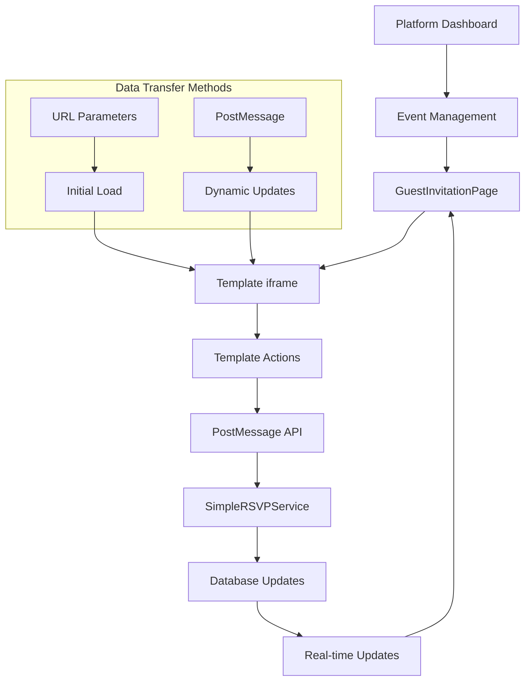
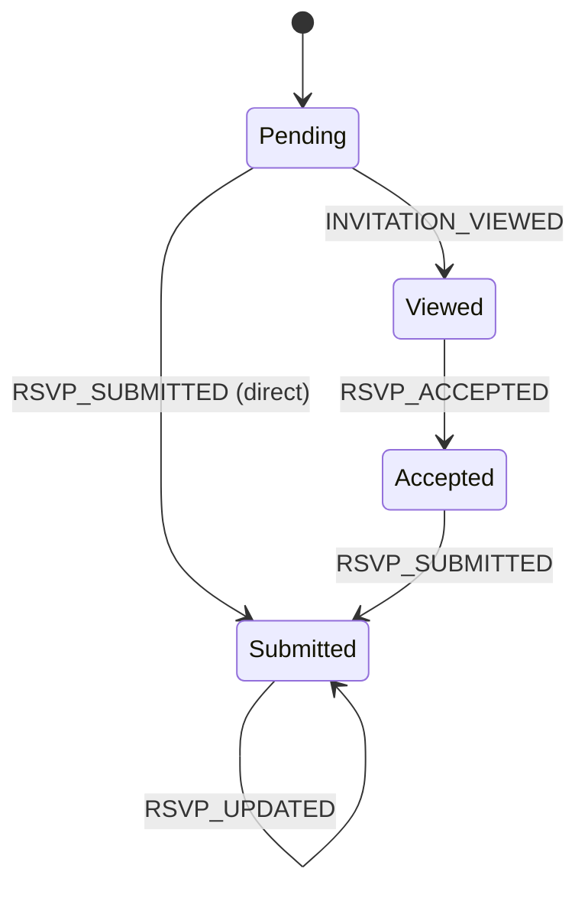

# Platform-Template Communication Guide

## Table of Contents
1. [Overview](#overview)
2. [Architecture & Data Flow](#architecture--data-flow)
3. [Communication Methods](#communication-methods)
4. [Guest Status System](#guest-status-system)
5. [RSVP Configuration System](#rsvp-configuration-system)
6. [Template Implementation Guide](#template-implementation-guide)
7. [Security & Error Handling](#security--error-handling)
8. [Testing & Troubleshooting](#testing--troubleshooting)

## Overview

This comprehensive guide details the communication system between the Utsavy platform and invitation templates. The system supports two communication methods - URL parameters for initial data transfer and PostMessage API for real-time bidirectional communication.

### Key Concepts
- **Platform**: The main Utsavy application that manages events and guests
- **Template**: The iframe-based invitation that guests see
- **Guest Status Flow**: A state machine managing guest interactions
- **RSVP System**: Flexible form system supporting simple acceptance and detailed responses

## Architecture & Data Flow



### Communication Flow
1. **Platform generates invitation URL** with essential parameters
2. **Template loads** and parses URL parameters
3. **Platform sends** `INVITATION_LOADED` message with complete data
4. **Template renders** interface based on guest status and RSVP configuration
5. **Guest interactions** trigger PostMessage events back to platform
6. **Platform processes** actions via SimpleRSVPService
7. **Database updates** occur with proper validation
8. **Platform sends** updated payload back to template if needed

## Communication Methods

### 1. URL Parameters (Primary Method)

URL parameters provide the essential data needed for template initialization.

#### Base URL Format
```
{template_base_url}?eventId={event_id}&guestId={guest_id}&status={status}&[additional_params]
```

#### Core Parameters
| Parameter | Type | Description | Example |
|-----------|------|-------------|---------|
| `eventId` | string | Event identifier (custom_event_id or UUID) | `ABC12` |
| `guestId` | string | Guest identifier (custom_guest_id or UUID) | `G01` |
| `status` | string | Current guest status | `pending`, `viewed`, `accepted`, `submitted` |

#### Example URL
```
https://template.example.com/invitation?eventId=ABC12&guestId=G01&status=pending
```

### 2. PostMessage API (Secondary Method)

Used for dynamic updates and bidirectional communication after iframe loads.

#### Platform → Template Messages

##### `INVITATION_LOADED`
Comprehensive data sent when template loads:

```javascript
{
  type: 'INVITATION_LOADED',
  payload: {
    // Core identifiers
    eventId: "ABC12",
    guestId: "G01",
    
    // RSVP Status & Controls (from SimpleRSVPService)
    status: null | "accepted" | "submitted",
    showSubmitButton: false,
    showEditButton: false,
    
    // Event Details
    eventDetails: {
      groom_name: "John Doe",
      bride_name: "Jane Smith",
      wedding_date: "2024-06-15",
      wedding_time: "18:00",
      venue_name: "Grand Ballroom",
      venue_address: "123 Wedding St, City",
      events: [
        {
          event_name: "Ceremony",
          event_date: "2024-06-15",
          event_time: "18:00",
          venue_name: "Chapel",
          venue_address: "123 Wedding St"
        }
      ],
      photos: [
        {
          url: "https://example.com/photo1.jpg",
          caption: "Engagement Photo"
        }
      ]
    },
    
    // RSVP Configuration
    rsvpFields: [
      {
        id: "uuid-1",
        field_name: "dietary_requirements",
        field_label: "Dietary Requirements",
        field_type: "textarea",
        is_required: false,
        placeholder_text: "Any special dietary needs?",
        display_order: 1
      }
    ],
    existingRsvpData: null, // or existing data for editing
    
    // Platform Metadata
    platformData: {
      guestName: "Guest Name",
      actualStatus: "pending", // Raw database status
      hasCustomFields: true,
      allowEdit: true
    }
  }
}
```

##### `INVITATION_PAYLOAD_UPDATE`
Sent after guest status changes:

```javascript
{
  type: 'INVITATION_PAYLOAD_UPDATE',
  data: {
    eventId: "ABC12",
    guestId: "G01",
    status: "accepted",
    showSubmitButton: true,
    showEditButton: false,
    rsvpFields: [...],
    existingRsvpData: null
  }
}
```

#### Template → Platform Messages

##### Track Invitation View
```javascript
window.parent.postMessage({
  type: 'INVITATION_VIEWED',
  data: {
    eventId: 'ABC12',
    guestId: 'G01'
  }
}, '*');
```

##### Accept Invitation (Simple RSVP)
```javascript
window.parent.postMessage({
  type: 'RSVP_ACCEPTED',
  data: {
    eventId: 'ABC12',
    guestId: 'G01'
  }
}, '*');
```

##### Submit Detailed RSVP
```javascript
window.parent.postMessage({
  type: 'RSVP_SUBMITTED',
  data: {
    eventId: 'ABC12',
    guestId: 'G01',
    rsvpData: {
      dietary_requirements: "Vegetarian",
      plus_one: "John Smith",
      special_requests: "Window seat preferred"
    }
  }
}, '*');
```

##### Update Existing RSVP
```javascript
window.parent.postMessage({
  type: 'RSVP_UPDATED',
  data: {
    eventId: 'ABC12',
    guestId: 'G01',
    rsvpData: {
      dietary_requirements: "Vegan", // Updated value
      plus_one: "Jane Smith",
      special_requests: "Aisle seat preferred"
    }
  }
}, '*');
```

## Guest Status System

The platform uses a mutually exclusive status system where each guest belongs to exactly one category.

### Status Definitions

#### 1. Pending
Guest hasn't viewed the invitation yet.
```javascript
{
  viewed: false,
  accepted: false,
  rsvp_data: null
}
```

#### 2. Viewed
Guest viewed but hasn't accepted the invitation.
```javascript
{
  viewed: true,
  accepted: false,
  rsvp_data: null
}
```

#### 3. Accepted
Guest accepted the invitation but hasn't submitted detailed RSVP (if required).
```javascript
{
  viewed: true,
  accepted: true,
  rsvp_data: null
}
```

#### 4. Submitted
Guest accepted and submitted detailed RSVP data.
```javascript
{
  viewed: true,
  accepted: true,
  rsvp_data: { /* form data */ }
}
```

### Status Transitions



### Template Support for Different Flows

#### With Accept Button (Traditional Flow)
1. Guest sees "Accept Invitation" button
2. Clicks accept → Status becomes "accepted"
3. If custom fields exist, form appears with "Submit RSVP" button
4. Submits form → Status becomes "submitted"

#### Without Accept Button (Direct Flow)
1. Guest sees RSVP form immediately (if custom fields exist)
2. Submits form → Status becomes "submitted" directly
3. `accepted` flag is automatically set to `true` during submission

## RSVP Configuration System

The platform supports flexible RSVP configurations to handle different event requirements.

### Configuration Types

#### Simple RSVP
Only requires acceptance, no additional form fields.

```json
{
  "type": "simple",
  "hasCustomFields": false
}
```

**Template Behavior:**
- Show accept/decline buttons only
- No additional form fields
- Guest status goes: pending → viewed → accepted

#### Detailed RSVP
Requires acceptance plus custom form submission.

```json
{
  "type": "detailed",
  "hasCustomFields": true,
  "allowEditAfterSubmit": true,
  "customFields": [
    {
      "id": "uuid-1",
      "field_name": "dietary_requirements",
      "field_label": "Dietary Requirements",
      "field_type": "textarea",
      "is_required": false,
      "placeholder_text": "Any special dietary needs?",
      "field_options": {},
      "validation_rules": {},
      "display_order": 1
    },
    {
      "id": "uuid-2",
      "field_name": "plus_one",
      "field_label": "Plus One Name",
      "field_type": "text",
      "is_required": true,
      "placeholder_text": "Full name of your guest",
      "display_order": 2
    },
    {
      "id": "uuid-3",
      "field_name": "meal_preference",
      "field_label": "Meal Preference",
      "field_type": "select",
      "is_required": true,
      "field_options": {
        "options": ["Vegetarian", "Non-Vegetarian", "Vegan"]
      },
      "display_order": 3
    }
  ]
}
```

**Template Behavior:**
- Show accept button first OR show form directly
- After acceptance, show custom form fields
- Guest status goes: pending → viewed → accepted → submitted
- Allow editing if `allowEditAfterSubmit` is true

### Field Types & Rendering

#### Text Input
```javascript
{
  "field_type": "text",
  "field_name": "guest_name",
  "field_label": "Guest Name",
  "placeholder_text": "Enter full name",
  "is_required": true
}
```

#### Email Input
```javascript
{
  "field_type": "email",
  "field_name": "contact_email",
  "field_label": "Contact Email",
  "placeholder_text": "your@email.com",
  "validation_rules": {
    "pattern": "email"
  }
}
```

#### Phone Input
```javascript
{
  "field_type": "phone",
  "field_name": "phone_number",
  "field_label": "Phone Number",
  "placeholder_text": "+1 (555) 123-4567"
}
```

#### Textarea
```javascript
{
  "field_type": "textarea",
  "field_name": "special_requests",
  "field_label": "Special Requests",
  "placeholder_text": "Any special accommodations needed?",
  "validation_rules": {
    "maxLength": 500
  }
}
```

#### Select Dropdown
```javascript
{
  "field_type": "select",
  "field_name": "meal_choice",
  "field_label": "Meal Preference",
  "field_options": {
    "options": ["Chicken", "Fish", "Vegetarian", "Vegan"]
  },
  "is_required": true
}
```

#### Radio Group
```javascript
{
  "field_type": "radio",
  "field_name": "attendance",
  "field_label": "Will you attend?",
  "field_options": {
    "options": ["Yes, I'll be there", "No, I can't make it"]
  },
  "is_required": true
}
```

#### Checkbox Group
```javascript
{
  "field_type": "checkbox",
  "field_name": "dietary_restrictions",
  "field_label": "Dietary Restrictions",
  "field_options": {
    "options": ["Gluten-free", "Dairy-free", "Nut allergy", "Other"]
  }
}
```

## Template Implementation Guide

### 1. Initial Setup & URL Parsing

```javascript
// Parse URL parameters on load
function parseURLParams() {
  const params = new URLSearchParams(window.location.search);
  return {
    eventId: params.get('eventId'),
    guestId: params.get('guestId'),
    status: params.get('status') // pending, viewed, accepted, submitted
  };
}

// Initialize template
const urlParams = parseURLParams();
if (!urlParams.eventId || !urlParams.guestId) {
  console.error('Missing required URL parameters');
  showErrorMessage('Invalid invitation link');
}
```

### 2. PostMessage Event Handling

```javascript
// Trusted origins for security
const trustedOrigins = [
  'https://utsavy.vercel.app',
  'https://utsavy.lovable.app',
  'http://localhost:3000' // Development only
];

// Listen for messages from platform
window.addEventListener('message', (event) => {
  // Security: Verify origin
  if (!trustedOrigins.includes(event.origin)) {
    console.warn('Untrusted origin:', event.origin);
    return;
  }
  
  const { type, payload, data } = event.data;
  
  switch (type) {
    case 'INVITATION_LOADED':
      handleInvitationLoaded(payload);
      break;
      
    case 'INVITATION_PAYLOAD_UPDATE':
      handlePayloadUpdate(data);
      break;
      
    default:
      console.log('Unknown message type:', type);
  }
});

// Handle initial invitation data
function handleInvitationLoaded(payload) {
  try {
    // Store event data globally
    window.eventData = payload.eventDetails;
    window.rsvpConfig = {
      status: payload.status,
      showSubmitButton: payload.showSubmitButton,
      showEditButton: payload.showEditButton,
      rsvpFields: payload.rsvpFields,
      existingRsvpData: payload.existingRsvpData
    };
    
    // Render the invitation
    renderEventDetails(payload.eventDetails);
    renderRSVPInterface(window.rsvpConfig);
    
    // Track view automatically
    trackInvitationView();
    
  } catch (error) {
    console.error('Error handling invitation data:', error);
    showErrorMessage('Failed to load invitation data');
  }
}

// Handle real-time updates
function handlePayloadUpdate(data) {
  window.rsvpConfig = data;
  renderRSVPInterface(data);
}
```

### 3. RSVP Interface Rendering

```javascript
function renderRSVPInterface(config) {
  const rsvpContainer = document.getElementById('rsvp-container');
  if (!rsvpContainer) return;
  
  // Clear existing content
  rsvpContainer.innerHTML = '';
  
  if (!config.status) {
    // Guest hasn't accepted yet
    if (config.rsvpFields && config.rsvpFields.length > 0) {
      // Has custom fields - can show accept button or direct form
      renderAcceptButton(rsvpContainer);
      // OR renderDirectRSVPForm(rsvpContainer, config.rsvpFields);
    } else {
      // Simple RSVP only
      renderAcceptDeclineButtons(rsvpContainer);
    }
  } else if (config.status === 'accepted' && config.showSubmitButton) {
    // Show detailed RSVP form
    renderDetailedRSVPForm(rsvpContainer, config.rsvpFields);
  } else if (config.status === 'submitted') {
    // Show confirmation and edit button if allowed
    renderConfirmation(rsvpContainer);
    if (config.showEditButton) {
      renderEditButton(rsvpContainer);
    }
  }
}

function renderAcceptButton(container) {
  const button = document.createElement('button');
  button.textContent = 'Accept Invitation';
  button.className = 'accept-btn';
  button.onclick = acceptInvitation;
  container.appendChild(button);
}

function renderAcceptDeclineButtons(container) {
  const acceptBtn = document.createElement('button');
  acceptBtn.textContent = 'Accept';
  acceptBtn.className = 'accept-btn';
  acceptBtn.onclick = acceptInvitation;
  
  const declineBtn = document.createElement('button');
  declineBtn.textContent = 'Decline';
  declineBtn.className = 'decline-btn';
  declineBtn.onclick = declineInvitation;
  
  container.appendChild(acceptBtn);
  container.appendChild(declineBtn);
}

function renderDetailedRSVPForm(container, fields) {
  const form = document.createElement('form');
  form.className = 'rsvp-form';
  form.onsubmit = handleRSVPSubmit;
  
  // Render form fields
  fields.forEach(field => {
    const fieldElement = createFormField(field);
    form.appendChild(fieldElement);
  });
  
  // Submit button
  const submitBtn = document.createElement('button');
  submitBtn.type = 'submit';
  submitBtn.textContent = 'Submit RSVP';
  submitBtn.className = 'submit-btn';
  form.appendChild(submitBtn);
  
  container.appendChild(form);
}

function renderDirectRSVPForm(container, fields) {
  // For templates that skip the accept button
  const form = document.createElement('form');
  form.className = 'rsvp-form direct-form';
  form.onsubmit = handleDirectRSVPSubmit;
  
  fields.forEach(field => {
    form.appendChild(createFormField(field));
  });
  
  const submitBtn = document.createElement('button');
  submitBtn.type = 'submit';
  submitBtn.textContent = 'Submit RSVP';
  form.appendChild(submitBtn);
  
  container.appendChild(form);
}
```

### 4. Form Field Creation

```javascript
function createFormField(field) {
  const wrapper = document.createElement('div');
  wrapper.className = 'form-field';
  
  // Label
  const label = document.createElement('label');
  label.textContent = field.field_label;
  if (field.is_required) {
    label.textContent += ' *';
    label.className = 'required';
  }
  
  // Input element based on type
  let input;
  
  switch (field.field_type) {
    case 'text':
    case 'email':
    case 'phone':
      input = document.createElement('input');
      input.type = field.field_type;
      input.placeholder = field.placeholder_text || '';
      break;
      
    case 'textarea':
      input = document.createElement('textarea');
      input.placeholder = field.placeholder_text || '';
      if (field.validation_rules?.maxLength) {
        input.maxLength = field.validation_rules.maxLength;
      }
      break;
      
    case 'select':
      input = document.createElement('select');
      
      // Add default option
      const defaultOption = document.createElement('option');
      defaultOption.value = '';
      defaultOption.textContent = 'Please select...';
      input.appendChild(defaultOption);
      
      // Add options
      if (field.field_options?.options) {
        field.field_options.options.forEach(option => {
          const optionEl = document.createElement('option');
          optionEl.value = option;
          optionEl.textContent = option;
          input.appendChild(optionEl);
        });
      }
      break;
      
    case 'radio':
      // Create radio group container
      const radioContainer = document.createElement('div');
      radioContainer.className = 'radio-group';
      
      if (field.field_options?.options) {
        field.field_options.options.forEach((option, index) => {
          const radioWrapper = document.createElement('div');
          radioWrapper.className = 'radio-option';
          
          const radio = document.createElement('input');
          radio.type = 'radio';
          radio.name = field.field_name;
          radio.value = option;
          radio.id = `${field.field_name}_${index}`;
          
          const radioLabel = document.createElement('label');
          radioLabel.htmlFor = radio.id;
          radioLabel.textContent = option;
          
          radioWrapper.appendChild(radio);
          radioWrapper.appendChild(radioLabel);
          radioContainer.appendChild(radioWrapper);
        });
      }
      
      wrapper.appendChild(label);
      wrapper.appendChild(radioContainer);
      return wrapper;
      
    case 'checkbox':
      // Create checkbox group container
      const checkboxContainer = document.createElement('div');
      checkboxContainer.className = 'checkbox-group';
      
      if (field.field_options?.options) {
        field.field_options.options.forEach((option, index) => {
          const checkboxWrapper = document.createElement('div');
          checkboxWrapper.className = 'checkbox-option';
          
          const checkbox = document.createElement('input');
          checkbox.type = 'checkbox';
          checkbox.name = `${field.field_name}[]`;
          checkbox.value = option;
          checkbox.id = `${field.field_name}_${index}`;
          
          const checkboxLabel = document.createElement('label');
          checkboxLabel.htmlFor = checkbox.id;
          checkboxLabel.textContent = option;
          
          checkboxWrapper.appendChild(checkbox);
          checkboxWrapper.appendChild(checkboxLabel);
          checkboxContainer.appendChild(checkboxWrapper);
        });
      }
      
      wrapper.appendChild(label);
      wrapper.appendChild(checkboxContainer);
      return wrapper;
  }
  
  // Set common attributes
  input.name = field.field_name;
  input.required = field.is_required;
  
  // Set existing value if editing
  if (window.rsvpConfig?.existingRsvpData?.[field.field_name]) {
    input.value = window.rsvpConfig.existingRsvpData[field.field_name];
  }
  
  wrapper.appendChild(label);
  wrapper.appendChild(input);
  return wrapper;
}
```

### 5. Event Handlers

```javascript
function trackInvitationView() {
  sendMessage('INVITATION_VIEWED', {
    eventId: urlParams.eventId,
    guestId: urlParams.guestId
  });
}

function acceptInvitation() {
  sendMessage('RSVP_ACCEPTED', {
    eventId: urlParams.eventId,
    guestId: urlParams.guestId
  });
}

function declineInvitation() {
  // Handle decline logic
  showDeclineMessage();
}

function handleRSVPSubmit(event) {
  event.preventDefault();
  
  const formData = new FormData(event.target);
  const rsvpData = {};
  
  // Process form data
  for (let [key, value] of formData.entries()) {
    if (key.endsWith('[]')) {
      // Handle checkbox arrays
      const cleanKey = key.slice(0, -2);
      if (!rsvpData[cleanKey]) rsvpData[cleanKey] = [];
      rsvpData[cleanKey].push(value);
    } else {
      rsvpData[key] = value;
    }
  }
  
  // Send to platform
  sendMessage('RSVP_SUBMITTED', {
    eventId: urlParams.eventId,
    guestId: urlParams.guestId,
    rsvpData
  });
}

function handleDirectRSVPSubmit(event) {
  event.preventDefault();
  
  // Same as handleRSVPSubmit but for direct submission
  // This automatically accepts and submits in one action
  const formData = new FormData(event.target);
  const rsvpData = {};
  
  for (let [key, value] of formData.entries()) {
    if (key.endsWith('[]')) {
      const cleanKey = key.slice(0, -2);
      if (!rsvpData[cleanKey]) rsvpData[cleanKey] = [];
      rsvpData[cleanKey].push(value);
    } else {
      rsvpData[key] = value;
    }
  }
  
  sendMessage('RSVP_SUBMITTED', {
    eventId: urlParams.eventId,
    guestId: urlParams.guestId,
    rsvpData
  });
}

function editRSVP() {
  // Re-render form with existing data for editing
  renderRSVPInterface({
    ...window.rsvpConfig,
    showSubmitButton: true,
    showEditButton: false
  });
}

// Generic message sender
function sendMessage(type, data) {
  try {
    window.parent.postMessage({
      type,
      data
    }, '*');
  } catch (error) {
    console.error('Failed to send message:', error);
    showErrorMessage('Failed to communicate with platform');
  }
}
```

### 6. Error Handling & User Feedback

```javascript
function showErrorMessage(message) {
  const errorDiv = document.createElement('div');
  errorDiv.className = 'error-message';
  errorDiv.textContent = message;
  
  // Add to page or show in modal
  document.body.appendChild(errorDiv);
  
  // Auto-remove after 5 seconds
  setTimeout(() => {
    if (errorDiv.parentNode) {
      errorDiv.parentNode.removeChild(errorDiv);
    }
  }, 5000);
}

function showSuccessMessage(message) {
  const successDiv = document.createElement('div');
  successDiv.className = 'success-message';
  successDiv.textContent = message;
  
  document.body.appendChild(successDiv);
  
  setTimeout(() => {
    if (successDiv.parentNode) {
      successDiv.parentNode.removeChild(successDiv);
    }
  }, 3000);
}

function showConfirmation() {
  const confirmationDiv = document.createElement('div');
  confirmationDiv.className = 'rsvp-confirmation';
  confirmationDiv.innerHTML = `
    <h3>RSVP Submitted Successfully!</h3>
    <p>Thank you for your response. We look forward to celebrating with you!</p>
  `;
  
  return confirmationDiv;
}
```

## Security & Error Handling

### Security Considerations

#### Origin Validation
Always validate PostMessage origins:

```javascript
const allowedOrigins = [
  'https://utsavy.vercel.app',
  'https://utsavy.lovable.app',
  'http://localhost:3000' // Development only
];

window.addEventListener('message', (event) => {
  if (!allowedOrigins.includes(event.origin)) {
    console.warn('Unauthorized origin:', event.origin);
    return;
  }
  // Process message...
});
```

#### Data Validation
Validate all incoming data:

```javascript
function validateEventData(payload) {
  if (!payload.eventId || !payload.guestId) {
    throw new Error('Missing required identifiers');
  }
  
  if (payload.rsvpFields && !Array.isArray(payload.rsvpFields)) {
    throw new Error('Invalid RSVP fields format');
  }
  
  return true;
}
```

#### Sanitize User Input
Always sanitize form data:

```javascript
function sanitizeFormData(data) {
  const sanitized = {};
  
  for (const [key, value] of Object.entries(data)) {
    if (typeof value === 'string') {
      // Basic HTML escaping
      sanitized[key] = value
        .replace(/&/g, '&amp;')
        .replace(/</g, '&lt;')
        .replace(/>/g, '&gt;')
        .replace(/"/g, '&quot;')
        .replace(/'/g, '&#x27;');
    } else {
      sanitized[key] = value;
    }
  }
  
  return sanitized;
}
```

### Error Handling Best Practices

#### Platform Side (SimpleRSVPService)
```javascript
export class SimpleRSVPService {
  static async handlePostMessage(message) {
    try {
      const { eventId, guestId } = message.data;
      
      // Validate required fields
      if (!eventId || !guestId) {
        throw new Error('Missing eventId or guestId');
      }
      
      // Validate guest exists
      const { data: guest } = await supabase
        .from('guests')
        .select('id')
        .eq('id', guestId)
        .single();
        
      if (!guest) {
        throw new Error('Guest not found');
      }
      
      // Process message...
      
    } catch (error) {
      console.error('Error in handlePostMessage:', error);
      throw error; // Re-throw for caller to handle
    }
  }
}
```

#### Template Side
```javascript
function handleError(error, context) {
  console.error(`Error in ${context}:`, error);
  
  // Show user-friendly message
  const userMessage = getUserFriendlyError(error);
  showErrorMessage(userMessage);
  
  // Optional: Send error report to platform
  sendMessage('ERROR_REPORT', {
    error: error.message,
    context,
    timestamp: new Date().toISOString()
  });
}

function getUserFriendlyError(error) {
  if (error.message.includes('network')) {
    return 'Network connection issue. Please check your internet and try again.';
  }
  
  if (error.message.includes('validation')) {
    return 'Please check your form inputs and try again.';
  }
  
  return 'Something went wrong. Please try again or contact support.';
}
```

## Testing & Troubleshooting

### Testing Checklist for Template Teams

#### 1. URL Parameter Testing
- [ ] Parse eventId and guestId correctly
- [ ] Handle missing parameters gracefully
- [ ] Test with both UUID and custom ID formats
- [ ] Verify status parameter handling for all states

#### 2. PostMessage Integration
- [ ] Listen for INVITATION_LOADED messages
- [ ] Handle INVITATION_PAYLOAD_UPDATE messages
- [ ] Send correct message format for all actions
- [ ] Verify origin validation works
- [ ] Test with real platform origins

#### 3. RSVP Flow Testing

##### Simple RSVP (No Custom Fields)
- [ ] Show accept/decline buttons
- [ ] Accept button sends RSVP_ACCEPTED
- [ ] Status updates to "accepted"
- [ ] Confirmation message appears

##### Detailed RSVP (With Custom Fields)
- [ ] Show accept button first (traditional flow)
- [ ] After acceptance, show form fields
- [ ] Submit button sends RSVP_SUBMITTED with form data
- [ ] Status updates to "submitted"
- [ ] Confirmation message appears

##### Direct RSVP (Skip Accept Button)
- [ ] Show form fields immediately
- [ ] Submit button sends RSVP_SUBMITTED
- [ ] Status jumps directly to "submitted"
- [ ] Guest.accepted is automatically set to true

##### Edit Mode
- [ ] Edit button appears when allowed
- [ ] Form pre-populates with existing data
- [ ] Submit sends RSVP_UPDATED message
- [ ] Data updates successfully

#### 4. Form Field Testing
- [ ] Text inputs render correctly
- [ ] Email validation works
- [ ] Phone formatting applies
- [ ] Textarea respects maxLength
- [ ] Select dropdowns populate options
- [ ] Radio groups allow single selection
- [ ] Checkbox groups allow multiple selection
- [ ] Required field validation works
- [ ] Form submission collects all data correctly

#### 5. Error Handling
- [ ] Network errors show user-friendly messages
- [ ] Invalid data shows appropriate feedback
- [ ] Missing parameters handled gracefully
- [ ] PostMessage failures don't break the template
- [ ] Form validation prevents invalid submissions

#### 6. Cross-browser Testing
- [ ] Chrome/Chromium
- [ ] Firefox
- [ ] Safari
- [ ] Edge
- [ ] Mobile browsers (iOS Safari, Chrome Mobile)

### Troubleshooting Common Issues

#### Issue: Template not receiving INVITATION_LOADED
**Symptoms:** Template loads but doesn't show event data
**Causes:**
- PostMessage listener not set up before iframe loads
- Origin validation blocking messages
- Template URL doesn't match expected domain

**Solutions:**
```javascript
// Set up listener immediately
window.addEventListener('message', handleMessage);

// Check console for origin validation errors
console.log('Template origin:', window.location.origin);

// Verify platform is sending to correct URL
```

#### Issue: RSVP buttons not appearing
**Symptoms:** Template loads but no interaction buttons show
**Causes:**
- Status parsing incorrect
- Button rendering logic flawed
- CSS hiding buttons

**Debug:**
```javascript
console.log('Current status:', window.rsvpConfig?.status);
console.log('Show submit button:', window.rsvpConfig?.showSubmitButton);
console.log('Show edit button:', window.rsvpConfig?.showEditButton);
```

#### Issue: Form submission not working
**Symptoms:** Submit button clicked but no response
**Causes:**
- Form data not collected properly
- PostMessage syntax incorrect
- Event bubbling prevented

**Debug:**
```javascript
function debugFormSubmit(event) {
  event.preventDefault();
  
  const formData = new FormData(event.target);
  const data = Object.fromEntries(formData);
  
  console.log('Form data:', data);
  console.log('Sending message...');
  
  // Test message sending
  try {
    window.parent.postMessage({
      type: 'RSVP_SUBMITTED',
      data: {
        eventId: urlParams.eventId,
        guestId: urlParams.guestId,
        rsvpData: data
      }
    }, '*');
    console.log('Message sent successfully');
  } catch (error) {
    console.error('Message sending failed:', error);
  }
}
```

#### Issue: Status not updating after submission
**Symptoms:** Form submits but interface doesn't update
**Causes:**
- Platform not sending INVITATION_PAYLOAD_UPDATE
- Template not handling update message
- Database update failed

**Debug:**
```javascript
// Check for update messages
window.addEventListener('message', (event) => {
  console.log('Received message:', event.data);
  
  if (event.data.type === 'INVITATION_PAYLOAD_UPDATE') {
    console.log('Payload update received:', event.data.data);
  }
});
```

### Performance Optimization

#### Lazy Loading
```javascript
// Only load heavy components when needed
function loadRSVPForm() {
  if (!window.formLoaded) {
    import('./rsvp-form-module.js').then(module => {
      module.initializeForm();
      window.formLoaded = true;
    });
  }
}
```

#### Message Throttling
```javascript
// Prevent message spam
let lastMessageTime = 0;
const MESSAGE_THROTTLE = 100; // ms

function sendThrottledMessage(type, data) {
  const now = Date.now();
  if (now - lastMessageTime < MESSAGE_THROTTLE) {
    return;
  }
  
  sendMessage(type, data);
  lastMessageTime = now;
}
```

#### Memory Management
```javascript
// Clean up event listeners when template unloads
window.addEventListener('beforeunload', () => {
  window.removeEventListener('message', handleMessage);
  // Clean up other listeners...
});
```

This comprehensive guide should provide template developers with everything they need to successfully integrate with the Utsavy platform's RSVP system. The key is understanding the guest status flow and implementing the PostMessage communication correctly for bidirectional updates.