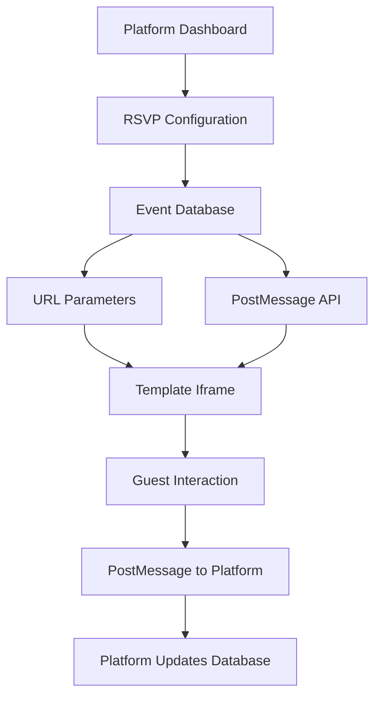
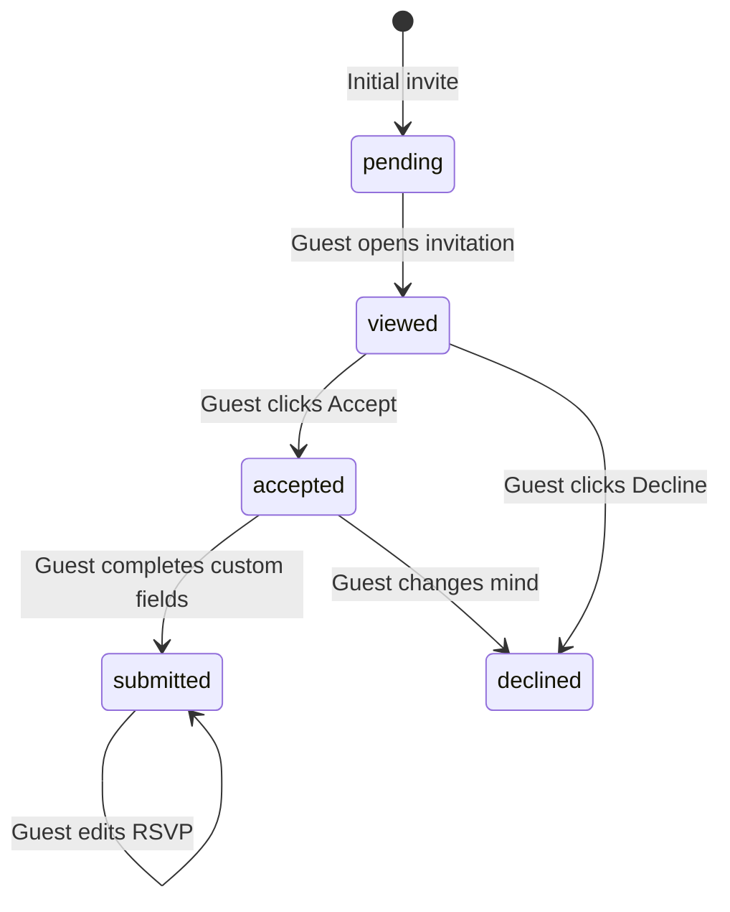

# RSVP Communication Guide for Template Teams

## Overview

This guide explains how RSVP communication works between the Utsavy platform and invitation templates. The platform supports both **Simple RSVP** (Accept/Decline only) and **Detailed RSVP** (Accept/Decline + custom form fields) modes.

## Communication Architecture



## Data Transfer Methods

### 1. URL Parameters (Primary Method)
Templates receive RSVP configuration through URL parameters when the invitation loads.

#### URL Structure
```
https://your-template.vercel.app/invitation?
  eventId=ABC123&
  guestId=XYZ&
  guestName=John%20Doe&
  guestStatus=pending&
  rsvpConfig={"type":"detailed","hasCustomFields":true}&
  customFields=[...field_definitions...]&
  existingRsvpData={"guests_count":"2"}&
  ...other_parameters
```

#### Key RSVP Parameters
- `rsvpConfig`: JSON string containing RSVP configuration
- `customFields`: JSON array of custom field definitions
- `guestStatus`: Current guest status (`pending`, `viewed`, `accepted`, `submitted`)
- `existingRsvpData`: Previously submitted RSVP data (for editing)

### 2. PostMessage API (Secondary Method)
For dynamic updates and bidirectional communication.

#### Platform → Template Messages
```javascript
// RSVP Configuration Update
{
  type: 'INVITATION_LOADED',
  data: {
    eventId: 'ABC123',
    guestId: 'XYZ',
    guestName: 'John Doe',
    guestStatus: 'pending',
    rsvpConfig: {
      type: 'detailed',
      hasCustomFields: true,
      customFields: [...]
    },
    existingRsvpData: {...}
  }
}
```

#### Template → Platform Messages
```javascript
// Guest accepts invitation
{
  type: 'RSVP_ACCEPTED',
  data: {
    accepted: true,
    rsvpData: {
      guests_count: '2',
      dietary_restrictions: 'Vegetarian',
      song_request: 'Perfect by Ed Sheeran'
    }
  },
  timestamp: Date.now(),
  source: 'TEMPLATE'
}

// Guest declines invitation
{
  type: 'RSVP_DECLINED',
  data: {
    accepted: false
  },
  timestamp: Date.now(),
  source: 'TEMPLATE'
}
```

## RSVP Configuration Types

### Simple RSVP (`type: "simple"`)
```json
{
  "type": "simple",
  "hasCustomFields": false
}
```

**Template Behavior:**
- Show only "Accept" and "Decline" buttons
- No additional form fields
- Immediate response when clicked

### Detailed RSVP (`type: "detailed"`)
```json
{
  "type": "detailed",
  "hasCustomFields": true,
  "customFields": [
    {
      "id": "guests_count",
      "field_name": "guests_count",
      "field_label": "Number of Guests",
      "field_type": "select",
      "is_required": true,
      "field_options": ["1", "2", "3", "4", "5+"],
      "display_order": 0
    },
    {
      "field_name": "dietary_restrictions",
      "field_label": "Dietary Restrictions",
      "field_type": "textarea",
      "is_required": false,
      "placeholder_text": "Any dietary restrictions?",
      "display_order": 1
    }
  ]
}
```

**Template Behavior:**
- Show "Accept" button that opens form
- Show "Decline" button for immediate decline
- Display custom form fields when accepting
- Collect additional data before final submission

## Guest Status Flow



### Status Descriptions
- **`pending`**: Guest hasn't opened invitation yet
- **`viewed`**: Guest opened invitation but hasn't responded
- **`accepted`**: Guest accepted but hasn't submitted custom fields
- **`submitted`**: Guest completed the full RSVP process
- **`declined`**: Guest declined the invitation

## Template Implementation

### 1. Parse URL Parameters
```javascript
function parseRSVPConfig() {
  const urlParams = new URLSearchParams(window.location.search);
  
  // Parse RSVP configuration
  const rsvpConfigParam = urlParams.get('rsvpConfig');
  let rsvpConfig = { type: 'simple' }; // Default fallback
  
  if (rsvpConfigParam) {
    try {
      rsvpConfig = JSON.parse(decodeURIComponent(rsvpConfigParam));
    } catch (e) {
      console.error('Failed to parse rsvpConfig:', e);
    }
  }
  
  // Parse custom fields
  const customFieldsParam = urlParams.get('customFields');
  let customFields = [];
  
  if (customFieldsParam) {
    try {
      customFields = JSON.parse(decodeURIComponent(customFieldsParam));
    } catch (e) {
      console.error('Failed to parse customFields:', e);
    }
  }
  
  // Parse guest status
  const guestStatus = urlParams.get('guestStatus') || 'pending';
  
  // Parse existing RSVP data
  const existingDataParam = urlParams.get('existingRsvpData');
  let existingRsvpData = {};
  
  if (existingDataParam) {
    try {
      existingRsvpData = JSON.parse(decodeURIComponent(existingDataParam));
    } catch (e) {
      console.error('Failed to parse existingRsvpData:', e);
    }
  }
  
  return {
    rsvpConfig,
    customFields,
    guestStatus,
    existingRsvpData
  };
}
```

### 2. Handle PostMessage Events
```javascript
window.addEventListener('message', (event) => {
  // Verify origin for security
  const allowedOrigins = [
    'https://your-platform-domain.lovableproject.com',
    'http://localhost:3000' // For development
  ];
  
  if (!allowedOrigins.includes(event.origin)) {
    return;
  }
  
  const { type, data } = event.data;
  
  switch (type) {
    case 'INVITATION_LOADED':
      updateRSVPInterface(data);
      break;
    case 'RSVP_CONFIG_UPDATED':
      handleRSVPConfigUpdate(data);
      break;
  }
});
```

### 3. Render RSVP Interface
```javascript
function renderRSVPInterface({ rsvpConfig, guestStatus, customFields, existingRsvpData }) {
  // If guest already responded, show thank you message
  if (guestStatus === 'submitted') {
    return renderThankYouMessage(true);
  }
  
  if (guestStatus === 'declined') {
    return renderThankYouMessage(false);
  }
  
  // For simple RSVP
  if (rsvpConfig.type === 'simple') {
    return renderSimpleRSVP();
  }
  
  // For detailed RSVP
  if (rsvpConfig.type === 'detailed') {
    if (guestStatus === 'accepted') {
      return renderDetailedForm(customFields, existingRsvpData);
    } else {
      return renderInitialAcceptDecline();
    }
  }
}

function renderSimpleRSVP() {
  return `
    <div class="rsvp-simple">
      <button onclick="acceptInvitation()" class="accept-btn">
        Accept Invitation
      </button>
      <button onclick="declineInvitation()" class="decline-btn">
        Decline
      </button>
    </div>
  `;
}

function renderDetailedForm(customFields, existingData) {
  let formHTML = '<form id="rsvp-form" onsubmit="submitDetailedRSVP(event)">';
  
  customFields.forEach(field => {
    formHTML += renderFormField(field, existingData[field.field_name]);
  });
  
  formHTML += `
    <button type="submit" class="submit-btn">Submit RSVP</button>
    <button type="button" onclick="cancelRSVP()" class="cancel-btn">Cancel</button>
    </form>
  `;
  
  return formHTML;
}
```

### 4. Handle Form Field Types
```javascript
function renderFormField(field, existingValue) {
  const value = existingValue || '';
  const required = field.is_required ? 'required' : '';
  
  switch (field.field_type) {
    case 'text':
      return `
        <div class="form-field">
          <label for="${field.field_name}">${field.field_label}</label>
          <input 
            type="text" 
            id="${field.field_name}" 
            name="${field.field_name}"
            placeholder="${field.placeholder_text || ''}"
            value="${value}"
            ${required}
          />
        </div>
      `;
      
    case 'textarea':
      return `
        <div class="form-field">
          <label for="${field.field_name}">${field.field_label}</label>
          <textarea 
            id="${field.field_name}" 
            name="${field.field_name}"
            placeholder="${field.placeholder_text || ''}"
            ${required}
          >${value}</textarea>
        </div>
      `;
      
    case 'select':
      const options = field.field_options || [];
      let optionsHTML = options.map(option => 
        `<option value="${option}" ${option === value ? 'selected' : ''}>${option}</option>`
      ).join('');
      
      return `
        <div class="form-field">
          <label for="${field.field_name}">${field.field_label}</label>
          <select id="${field.field_name}" name="${field.field_name}" ${required}>
            <option value="">Choose an option</option>
            ${optionsHTML}
          </select>
        </div>
      `;
      
    default:
      return '';
  }
}
```

### 5. Send Responses to Platform
```javascript
function acceptInvitation() {
  window.parent.postMessage({
    type: 'RSVP_ACCEPTED',
    data: {
      accepted: true
      // No rsvpData for simple acceptance
    },
    timestamp: Date.now(),
    source: 'TEMPLATE'
  }, '*');
}

function declineInvitation() {
  window.parent.postMessage({
    type: 'RSVP_DECLINED',
    data: {
      accepted: false
    },
    timestamp: Date.now(),
    source: 'TEMPLATE'
  }, '*');
}

function submitDetailedRSVP(event) {
  event.preventDefault();
  
  const formData = new FormData(event.target);
  const rsvpData = {};
  
  // Collect form data
  for (let [key, value] of formData.entries()) {
    rsvpData[key] = value;
  }
  
  // Send to platform
  window.parent.postMessage({
    type: 'RSVP_ACCEPTED',
    data: {
      accepted: true,
      rsvpData: rsvpData
    },
    timestamp: Date.now(),
    source: 'TEMPLATE'
  }, '*');
}
```

## Security Considerations

### 1. Origin Validation
Always validate the origin of PostMessage events:

```javascript
const ALLOWED_ORIGINS = [
  'https://your-platform-domain.lovableproject.com',
  'http://localhost:3000' // Development only
];

window.addEventListener('message', (event) => {
  if (!ALLOWED_ORIGINS.includes(event.origin)) {
    console.warn('Unauthorized origin:', event.origin);
    return;
  }
  // Process message...
});
```

### 2. Data Validation
Validate all incoming data:

```javascript
function validateRSVPData(data) {
  if (!data || typeof data !== 'object') {
    throw new Error('Invalid RSVP data format');
  }
  
  if (!data.hasOwnProperty('accepted')) {
    throw new Error('Missing required field: accepted');
  }
  
  if (typeof data.accepted !== 'boolean') {
    throw new Error('Invalid accepted field type');
  }
  
  return true;
}
```

## Error Handling

### 1. Graceful Fallbacks
```javascript
function getRSVPConfig() {
  try {
    const config = parseRSVPConfig();
    return config;
  } catch (error) {
    console.error('Error parsing RSVP config:', error);
    // Fallback to simple RSVP
    return {
      rsvpConfig: { type: 'simple' },
      customFields: [],
      guestStatus: 'pending',
      existingRsvpData: {}
    };
  }
}
```

### 2. User Feedback
```javascript
function showErrorMessage(message) {
  // Show user-friendly error message
  const errorDiv = document.createElement('div');
  errorDiv.className = 'error-message';
  errorDiv.textContent = message;
  document.body.appendChild(errorDiv);
  
  // Auto-remove after 5 seconds
  setTimeout(() => {
    errorDiv.remove();
  }, 5000);
}
```

## Testing Checklist

### For Template Teams:

1. **Simple RSVP Testing**
   - [ ] Accept button sends correct message
   - [ ] Decline button sends correct message
   - [ ] No form fields are shown
   - [ ] Thank you message appears after response

2. **Detailed RSVP Testing**
   - [ ] Accept button opens form
   - [ ] Decline button works immediately
   - [ ] All custom fields render correctly
   - [ ] Required field validation works
   - [ ] Form submission sends complete data
   - [ ] Edit mode populates existing data

3. **Status Flow Testing**
   - [ ] Pending status shows buttons
   - [ ] Viewed status shows buttons
   - [ ] Accepted status shows form (detailed) or thank you (simple)
   - [ ] Submitted status shows thank you
   - [ ] Declined status shows thank you

4. **Error Handling Testing**
   - [ ] Invalid RSVP config gracefully defaults to simple
   - [ ] Missing custom fields doesn't break the form
   - [ ] Network errors don't crash the template
   - [ ] Invalid PostMessage data is handled safely

## Platform Integration Support

For issues or questions about RSVP integration:

1. **Development Tools**
   - Use browser console to debug URL parameters
   - Monitor PostMessage events in browser dev tools
   - Check network tab for any failed requests

2. **Common Issues**
   - **RSVP buttons not showing**: Check `guestStatus` parameter
   - **Custom fields not rendering**: Verify `customFields` JSON parsing
   - **Form not submitting**: Ensure PostMessage format is correct
   - **Existing data not loading**: Check `existingRsvpData` parameter

3. **Contact Support**
   - Provide browser console logs
   - Include the full invitation URL (with parameters)
   - Describe expected vs actual behavior
   - Share any error messages

This guide ensures seamless RSVP communication between your template and the Utsavy platform, providing guests with a smooth experience regardless of the RSVP complexity required.